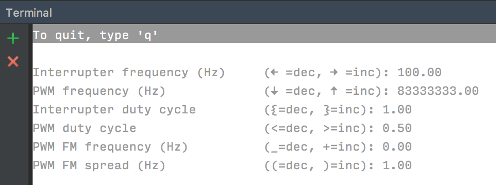

# CdF Plasma Controller

Raspberry Pi-based PWM controller for plasma tubes that support
the Open Sound Control (OSC) protocol.


## Installation


### On the Raspberry Pi

Clone the repository.

```
cd ~/
git clone git@github.com:coup-de-foudre/cdf-plasma-controller.git
cd cdf-plasma-controller/
```


#### Install `python3` with `pip` and the requirements

We require Python3 and pip, which you have to install:

```
sudo apt-get update && sudo apt-get install -y python3-pip
sudo pip3 install -r requirements.txt
```

#### Install `pigpio` from source and start the daemon

The CdF Plasma Controller requires the `pigpio` installation, and in particular,
the `pigpiod` daemon should be running. To install the `pigpio` driver on a 
Raspberry Pi, run

```
wget https://github.com/joan2937/pigpio/archive/V67.tar.gz
tar -xf V67.tar.gz
cd pigpio-67
make
sudo make install
```

You then need to start the daemon using

```
sudo pigpiod
```

#### Running the daemon on startup

To have the daemon run on startup, first `cd` into the `pigpio-67` directory
above and then run

```
cd util/
sudo cp pigpiod /etc/init.d/pigpiod
sudo chmod +x /etc/init.d/pigpiod
sudo update-rc.d pigpiod defaults
sudo service pigpiod start
```

You can now start, stop and restart the `pigpiod` service using the commands

```
sudo service pigpiod start
sudo service pigpiod stop
sudo service pigpiod restart
```

See the `README.md` [here](https://github.com/joan2937/pigpio/tree/master/util)
for more details. 

> **Note** If you installed the older version of `pigpiod` using `apt-get`,
> you may need to unmask previous service using `sudo systemctl unmask pigpiod`.
> (You can check if it's masked using ` sudo systemctl status pigpiod`.)


### On a client machine external to the Raspberry Pi

If you want to run over a network, you'll need to have Python 3.4 or greater 
(preferably 3.6) and `pip3` installed on the client machine. (Google it.) Then
clone this repo and run

```
sudo pip3 install -r requirements.txt
```

You should now be able to connect to a remote Raspberry Pi running the
`pigpiod` daemon. 


## Running

There are two ways to control the PWM, either via the keyboard or
using the Open Sound Control protocol. The next two sections
provide examples of using it both ways.

For the full range of options, see `./plasma_controller.py -h`.


### Using the keyboard

The simplest way to use this package is via the keyboard controller,
which allows you to change the parameters using key strokes. If you
have this package installed on a Raspberry Pi following the directions
above, try running the PWM with an initial frequency of 10000 Hz:

```bash
./plasma_controller.py -f 10000.0
```

You'll see a screen that looks like this:



Use the specified keys to increment or decrement the parameter values.


### Using Open Sound Control (OSC)

This package also allows control of the PWM via the Open Sound Control (OSC)
protocol. 

To enable OSC, setting the `--controller-type=OSC` flag on the command line.
This starts a OSC server on UDP port `5005` with the following endpoints:

  - `/pwm/start`
    Start the PWM, but does not turn on the interrupter or the FM modulator.

  - `/pwm/stop`
    Stop the PWM Also turns the interrupter and FM modulator off.

  - `/pwm/toggle <value>`
    Toggle based on the value of the argument. No argument or a
    "falsey" value turns stops, while a "truthy" value starts.

  - `/pwm/center-frequency <float>`
     PWM center frequency in Hz. Resets the fine control value to zero.

  - `/pwm/fine/spread <float>`
    Set fine control frequency spread around the center frequency

  - `/pwm/fine/value <float>`
    Set fine control frequency value. Value is capped between [-1, 1].
    The true frequency is given by

        center-frequency + value * spread

    where spread is set with /pwm/fine/spread.
    
  - `/pwm/frequency-offset-factor <float>`
    Offset factor for the center frequency. Should be between [-1, 1].
    The true frequency is given by

    ```bash
    center-frequency * (1 + offset-factor)
    ```

    This simplifies implementing small changes of the input frequency around a 
    fixed center frequency.

    Use of this endpoint immediately stops the FM modulator.

  - `/pwm/duty-cycle <float>`
    Set the PWM duty cycle. Settings other than 0.5 (the default) create a DC 
    offset in the output, which may damage some circuit configurations. 

  - `/pwm/fm/start`
    Start FM modulation.

  - `/pwm/fm/stop`
    Stop FM modulation.

  - `/pwm/fm/toggle <value>`
    Toggle based on the value of the argument. No argument or a
    "falsey" value turns stops, while a "truthy" value starts.

  - `/pwm/fm/spread <float>`
    Set the PWM FM spread in Hz.

  - `/pwm/fm/frequency <float>`
    Set the PWM FM frequency in Hz. Use of this endpoint starts the FM
    modulation.

  - `/pwm/interrupter/start`
    Start the interrupter.

  - `/pwm/interrupter/stop`
    Stop the interrupter.

  - `/pwm/interrupter/toggle <value>`
    Toggle based on the value of the argument. No argument or a
    "falsey" value turns stops, while a "truthy" value starts.
  
  - `/pwm/interrupter/frequency <float>`
    Interrupter frequency in Hz.

  - `/pwm/interrupter/duty-cycle <float>`
    Interrupter duty cycle in Hz.
    
The default root `/pwm/` is configurable for adding new channels via the
`--osc-roots` parameter.

You can test OSC using the included `osc_client.py` utility. You can test that
the server is receiving messages as follows:

```bash
# On RPi on localhost, local network address 192.168.2.247:5005
./plasma_controller.py --controller-type OSC -vv -f 10000

# In a separate terminal screen same RPi
./plasma/osc_client.py /pwm/center-frequency 10001

# From another machine on the local network
./plasma/osc_client.py --host 192.168.2.247 /pwm/center-frequency 10001
```

If it's successful, you should see output that looks like the following:

```
DEBUG:controller.osc_controller:{'offset_factor': None, 'center_frequency': 10001, 'osc_path': '/pwm/center-frequency', ...}
```

> **Note** The server only supports OSC over UDP. If you have difficulty 
> receiving messages, make sure that your client is configured to use UDP, not
> TCP.


### Additional Examples

1. Run in interrupted mode, with the interrupter running at 100Hz and 30% duty 
cycle.

    ```bash
    ./plasma_controller.py -F 100 -D 0.3 -f 30000
    ```
    > **NOTE** Running interruption over a network is not recommended, since 
    > network latency will significantly affect the interruption rate.

1. Control the RPi at address 192.168.2.247 on pin 12 at 15kHz.

    ```bash
    ./plasma_controller.py --pin 12 --host 192.168.2.247 -f 15000
    ```

1. Start an OSC controller with initial frequency of 83.3MHz with root `pwm1`
   and verbose logging:

    ```bash
    ./plasma_controller.py --controller-type OSC -f 83300000 -r pwm1 -vvv
    ```


## Copyright and License

    Copyright 2018, Michael McCoy <michael.b.mccoy@gmail.com>
    
    This file is part of the CdF Plasma Controller.
    
    The CdF Plasma Controller is free software: you can redistribute it and/or 
    modify it under the terms of the GNU Affero General Public License as 
    published by the Free Software Foundation, either version 3 of the License, 
    or (at your option) any later version.
    
    CdF Plasma Controller is distributed in the hope that it will be useful, 
    but WITHOUT ANY WARRANTY; without even the implied warranty of 
    MERCHANTABILITY or FITNESS FOR A PARTICULAR PURPOSE.  See the GNU Affero
    General Public License for more details.
    
    You should have received a copy of the GNU Affero General Public License
    along with the Cdf Plasma Controller.  If not, see 
    <http://www.gnu.org/licenses/>.
